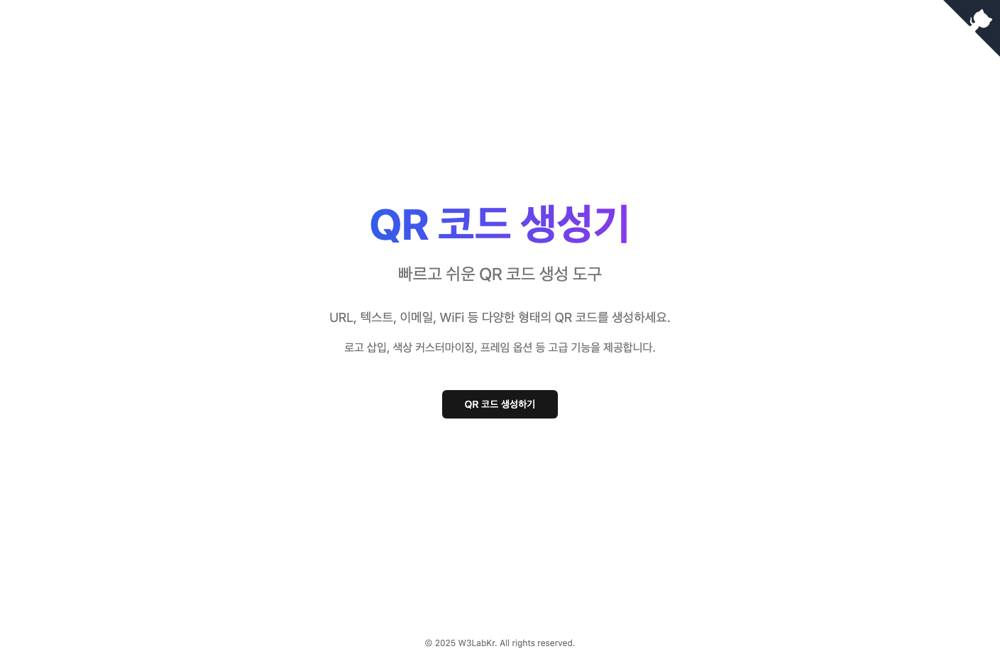

# 오픈소스 QR 코드 생성기

[](https://opensource.org/licenses/MIT)

> 회원가입이나 로그인 없이 누구나 즉시 사용할 수 있는 강력하고 아름다운 정적 QR 코드 생성기

이 프로젝트는 Next.js 14, Tailwind CSS, Shadcn UI를 사용하여 구축된 오픈소스 QR 코드 생성기입니다. 사용자는 다양한 유형의 정적 QR 코드를 생성하고, 색상, 로고, 모양 등 광범위한 옵션을 통해 자유롭게 커스터마이징할 수 있습니다.



## 주요 기능

- **다양한 콘텐츠 유형 지원**: URL, 텍스트, Wi-Fi 정보를 QR 코드로 변환할 수 있습니다.
- **다중 인증 시스템**: Google OAuth 인증을 지원하여 사용자가 안전하게 로그인할 수 있습니다.
- **QR 코드 히스토리 관리**: 로그인한 사용자는 생성한 QR 코드를 자동으로 저장하고 관리할 수 있습니다.
- **자유로운 커스터마이징**: 전경색, 배경색, 로고 삽입, QR 코드 둥글기 및 모서리 패턴 변경 등 세밀한 디자인 설정이 가능합니다.
- **고해상도 다운로드**: 생성된 QR 코드를 PNG, SVG, JPG 등 다양한 형식으로 다운로드할 수 있습니다.
- **프레임 추가**: "스캔해 주세요!"와 같은 문구를 포함한 여러 유형의 프레임을 추가하여 사용자의 스캔을 유도할 수 있습니다.
- **Wi-Fi QR 코드 지원**: Wi-Fi 네트워크 정보를 쉽게 QR 코드로 변환하여 즉시 네트워크에 연결할 수 있습니다.
- **PWA 지원**: 오프라인 환경에서도 웹 애플리케이션을 사용할 수 있습니다.

## 기술 스택

- **Framework**: [Next.js 14](https://nextjs.org/) (App Router)
- **Styling**: [Tailwind CSS](https://tailwindcss.com/)
- **UI Components**: [Shadcn UI](https://ui.shadcn.com/)
- **Authentication**: [Auth.js](https://authjs.dev/) (NextAuth v5) with Google OAuth
- **Database**: [Prisma](https://prisma.io/) ORM with [Supabase](https://supabase.com/) PostgreSQL
- **QR Code Generation**: [qr-code-styling-node](https://www.npmjs.com/package/qr-code-styling-node), [qrcode](https://www.npmjs.com/package/qrcode)
- **Deployment**: [Vercel](https://vercel.com/)

## 시작하기

### 1. 저장소 복제

```bash
git clone https://github.com/w3labkr/nextjs14-qrcode-generator.git
cd nextjs14-qrcode-generator
```

### 2. 종속성 설치

```bash
npm install
```

### 3. 환경 변수 설정

`.env.example` 파일을 복사하여 `.env.local` 파일을 생성하고 필요한 환경 변수를 설정하세요:

```bash
cp .env.example .env.local
```

#### 필수 환경 변수:

- `AUTH_SECRET`: Auth.js 세션 암호화용 비밀 키
- `DATABASE_URL`: Supabase PostgreSQL 데이터베이스 연결 URL

#### Supabase 설정

1. [Supabase](https://supabase.com/)에서 새 프로젝트를 생성합니다
2. 프로젝트 설정에서 데이터베이스 URL을 복사합니다
3. `.env.local` 파일에 `DATABASE_URL`을 설정합니다:

   ```bash
   DATABASE_URL="postgresql://postgres:[YOUR-PASSWORD]@[YOUR-PROJECT-REF].supabase.co:5432/postgres"
   ```

#### 선택적 환경 변수 (고급 기능 사용 시)

**Google OAuth (소셜 로그인)**:

- `AUTH_GOOGLE_ID`: Google OAuth 클라이언트 ID
- `AUTH_GOOGLE_SECRET`: Google OAuth 클라이언트 시크릿

### 4. 데이터베이스 설정

```bash
npx prisma generate
npx prisma migrate dev --name init
```

### 5. 개발 서버 실행

```bash
npm run dev
```

### 6. 프로덕션 빌드

```bash
npm run build
npm start
```

이제 브라우저에서 `http://localhost:3000`으로 접속하여 애플리케이션을 확인할 수 있습니다.

## 문서

프로젝트의 추가 문서는 다음에서 확인할 수 있습니다:

- [기능 상세 설명](./docs/FEATURES.md) - 주요 기능 사용법 및 세부 설정
- [의존성 패키지 목록](./docs/DEPENDENCIES.md) - 프로젝트에 사용된 패키지 정보

## 보안

보안 취약점 보고나 관련 문의는 [SECURITY.md](./SECURITY.md) 파일을 참고해주세요.

## 기여 방법

이 프로젝트는 오픈소스이며, 여러분의 기여를 환영합니다. 버그 리포트, 기능 제안, 코드 기여 등 어떤 형태의 참여든 환영합니다.

자세한 내용은 [CONTRIBUTING.md](./CONTRIBUTING.md) 파일을 참고해주세요.

## 라이선스

이 프로젝트는 MIT 라이선스를 따릅니다. 자세한 내용은 [LICENSE](./LICENSE) 파일을 참고해주세요.
